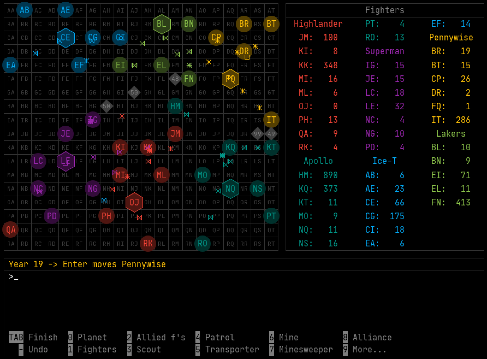

# STERN

A strategy game since 1989.

## Author

Michael Schweitzer

## Website and Download

[https://stern.dyndns1.de](https://stern.dyndns1.de)

## What is STERN?

Space, a final frontier. Conquer as many planets as possible with your spaceships. The player with the most planets wins the game.

STERN works like a turn-based board game: two to six players enter their moves. Then the computer evaluates the moves and moves the spaceships, whereupon the next round begins.

Strategic thinking, communication between the players, diplomacy and negotiating skills are required. And a little luck. That is why STERN unfolds its greatest appeal in a sociable group of four players or more. There are no computer opponents, nor are there any sound or graphics effects.

The STERN space is a grid of square sectors. In some sectors there are planets that have to be conquered and defended. As you send ships from planet to planet, they will fly at constant speed in a straight line from the center of the starting sector to the center of the target sector.

Planets produce money every year, simply called $ in STERN. New fighters, scouts, patrols, transporters, minelayers, minesweepers and defense shields are created from the $ produced. And finally, you can use $ to increase the $ production of planets.

Fight alone or make alliances with your fellow players to defend or attack planets together.

You can play STERN in different ways:

* In "Hot Seat" mode, the players sit at a computer and enter their moves one after the other. A large second monitor or projector is recommended for this mode.

* In an email game, players enter their moves on their computers and email them to the game host.

* As a server game: Set up your own STERN server on which the games are hosted. The players enter their moves on their own computers and send them to the server, which carries out the annual evaluations. You can use it to host a "LAN party" or enable players from all over the world to take part in a STERN game.

## Built With

Eclipse, Java 1.8

## License

This project is licensed under the [GNU Affero General Public License](http://www.gnu.org/licenses/agpl-3.0.de.html)

## Acknowledgments

* [GSON](https://github.com/google/gson/blob/master/LICENSE) (c) Google. See also file [src/ApacheLicense-2.0.txt](src/ApacheLicense-2.0.txt)
* [iText PDF](http://www.gnu.org/licenses/agpl-3.0.de.html) (c) ITEXT GROUP NV. [GNU Affero General Public License](http://www.gnu.org/licenses/agpl-3.0.de.html)
* [JetBrains Mono](https://www.jetbrains.com) (c) JetBrains. See also file [src/ApacheLicense-2.0.txt](src/ApacheLicense-2.0.txt)
* [Material Design Icons](https://material.io/resources/icons/?style=baseline). See also file [src/ApacheLicense-2.0.txt](src/ApacheLicense-2.0.txt)
* SpringUtilities (c) 1995, 2008, Oracle and/or its affiliates
